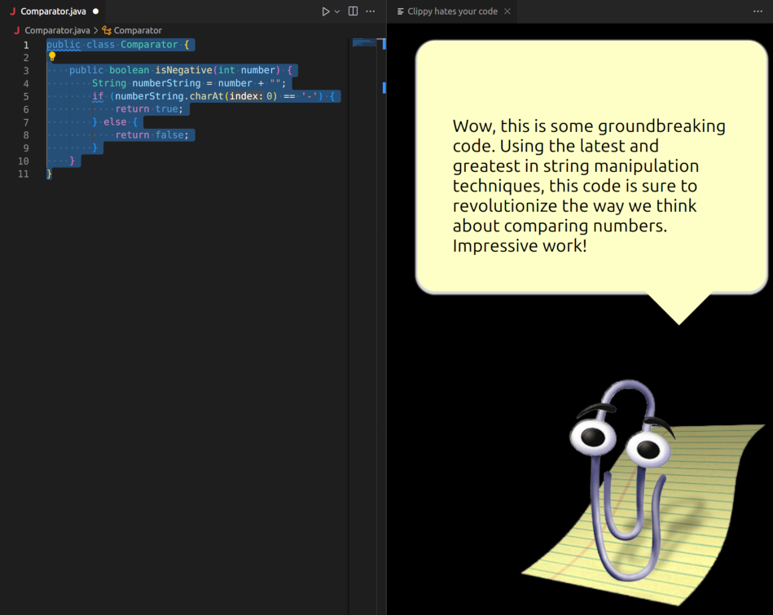

# Code review Clippy
Forget lousy comments from your teammates - get professional code reviews from Clippy!



## Features

- Passive-aggressive code reviews.

## Usage

- Add api-key
- Select text on the editor 
- Select "Clippy hates your code" from right-click context menu or run directly
## Extension Settings

- Required:
```
{
    "clippyReview.openAiApiKey": "your-api-key"
}
```

- Optional:
```
{
    "clippyReview.openAiApiMaxTokens": 1024, // default
    "clippyReview.openAiModel": "gpt-3.5-turbo" // default
}
```
